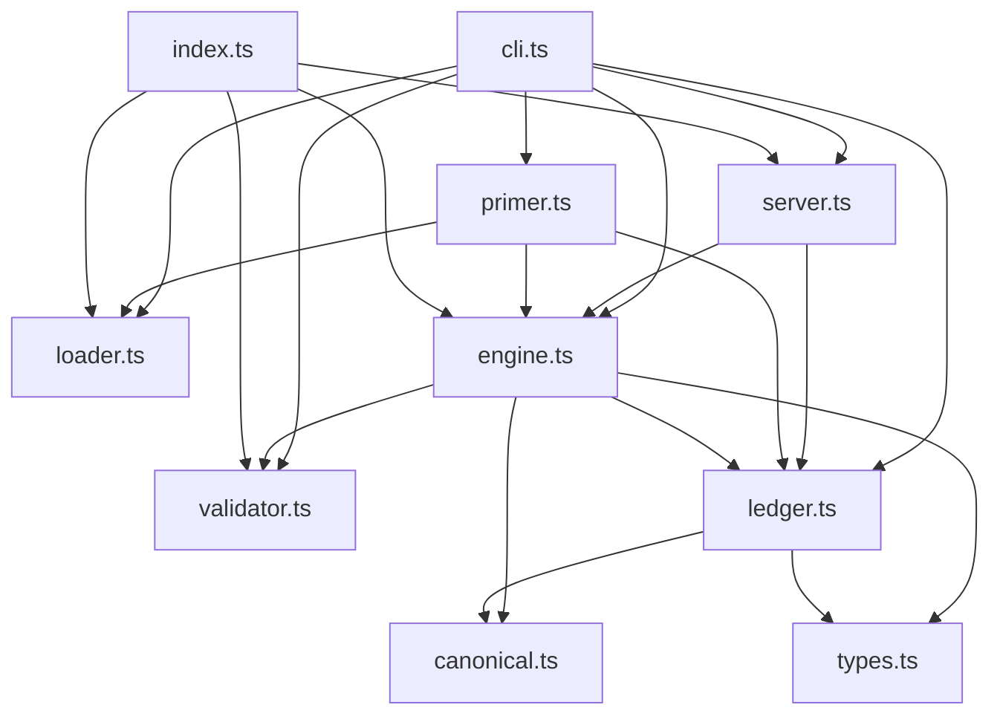

# Architecture

Xanthe is a thin adapter over [XState](https://stately.ai/docs/xstate) and the
[MCP TypeScript SDK](https://github.com/modelcontextprotocol/typescript-sdk). The
contributions are four small modules: mount, gating, ledger, and validator. Nothing
about state machines or MCP is reinvented.

The module graph (from `npm run introspect`, which also checks for cycles) is a clean
layering with no circular dependencies:



## Modules

| module         | responsibility                                                                       | depends on                                  |
| -------------- | ------------------------------------------------------------------------------------ | ------------------------------------------- |
| `types.ts`     | shared types: `CanonicalState`, `LedgerEntry`, `StepResult`, `StateView`             | none                                        |
| `canonical.ts` | deterministic JSON + the hash function (SHA-256 / HMAC, algorithm-tagged)            | none                                        |
| `validator.ts` | mount-time check that a machine is a step-gated circuit (no auto-advance)            | xstate                                      |
| `loader.ts`    | load a plain XState machine from `<file>#<export>` via jiti                          | xstate, jiti                                |
| `ledger.ts`    | `LedgerStore` (file + memory), `verifyChain`                                         | canonical, types                            |
| `engine.ts`    | mount a machine, gate steps via `snapshot.can`, settle one beat, record, reset, fork | canonical, ledger, types, validator, xstate |
| `server.ts`    | wire the engine to the five MCP tools over stdio                                     | engine, ledger, mcp-sdk                     |
| `primer.ts`    | the offline, deterministic demo                                                      | engine, ledger, loader, types               |
| `cli.ts`       | `serve` / `doctor` / `verify` / `primer` dispatch                                    | all of the above                            |
| `index.ts`     | public library surface                                                               | re-exports                                  |

## The one-beat invariant

The engine's one job is to keep a one-to-one correspondence between an agent
decision, a recorded ledger beat, and the machine settling into one decision state.
`validator.ts` enforces it statically at mount (reject `after`, `always` cascades,
invoke chains); `engine.ts` enforces it at runtime by settling through at most one
invoked actor before recording the beat. Everything else (gating, the legal-move
menu, fork, the hash chain) depends on that correspondence holding.

## Regenerating

```sh
npm run introspect          # module graph + cycle check (no extra tools)
npm run introspect:graph    # render docs/dependency-graph.svg (needs graphviz)
```
